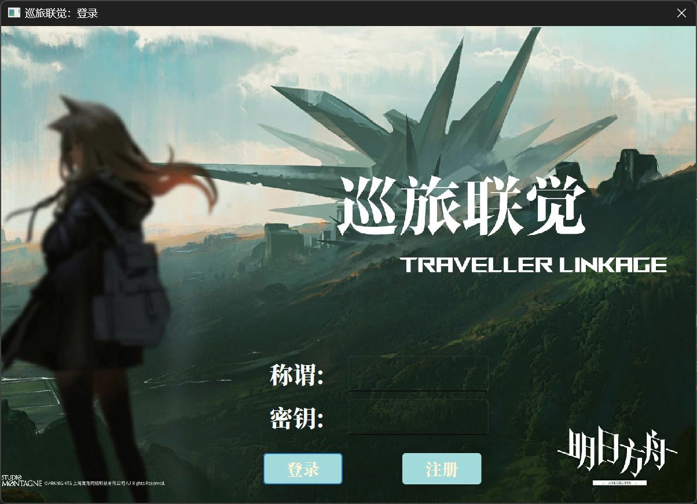

# 巡旅联觉 - Traveller's Linkage

> BJTU 2024秋季学期 数据结构实训大作业

## 1. 项目概述

### 1.1 介绍

本产品名为《巡旅联觉》(Traveller Linkage），是一款老少咸宜的益智解谜类游戏。本产品的目标用户为喜欢挑战思维的玩家，

旨在成为一人闲暇时打发时间，或者网络多人益智类对战小游戏的优选。

借由连连看简单的规则和无限的随机性，提供轻松愉快的游戏体验，锻炼玩家的反应能力和逻辑思维。




### 1.2 功能

- 连连看的基本功能（提示、暂停游戏、生成关卡时保证不生成僵局）
- E、C 自动解题（多线程）
- G 不同难度选择
- H 基于Flask的登录、注册（详见[Python后端](https://github.com/Stanley-233/2024-BJTU-datastructure-finalproject/tree/main/server/backend)）
  - H 应用部署到云服务器上
- A 每日挑战模式，记录总榜和每日挑战排行榜
- B 安卓应用（可以在[Release页面](https://github.com/Stanley-233/2024-BJTU-datastructure-finalproject/releases)下载）
- D 本地数据库成绩记录

## 2. 构建

构建系统：``>= CMake 3.16``

编译器：``MSVC 2022(19.36.32546)``

安卓编译器：``Qt 6.8.0 Clang arm64-v8a``

NDK：``26.1.10909125``

Qt版本：``Qt 6.8(Widgets Sql Multimedia)``

```shell
git clone https://github.com/Stanley-233/2024-BJTU-datastructure-finalproject.git
mkdir build
cd .\build
cmake ..
cmake --build .
```

> 声明：本项目在 2025.1.31 日后的网络相关 API 将被移除。请用户本地使用搭建后端服务。

## 3. 其他

### 3.1 许可证声明

本项目源代码按MIT协议开源，但美术素材除外。

本项目美术资源主要来源于[PRTS.wiki](https://prts.wiki/w/%E9%A6%96%E9%A1%B5)，相关素材的版权归鹰角网络所有。

